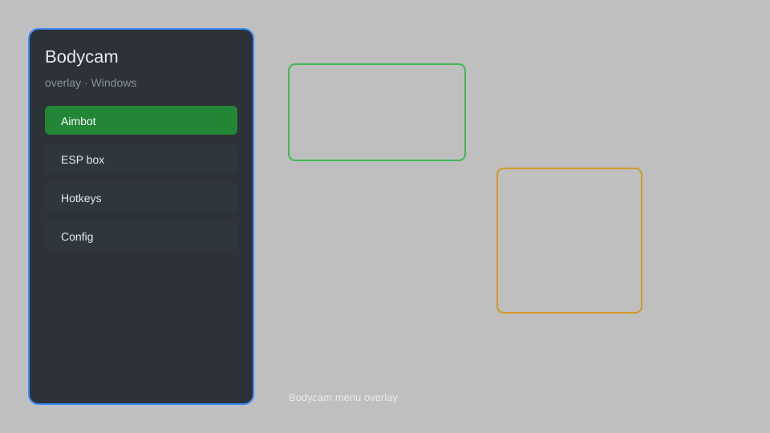

# Bodycam Overlay — ESP, Aimbot, Radar, No Recoil 🎥

Bodycam overlay with ESP, aimbot, radar, no recoil, speed hack, and more for Bodycam. For educational purposes only.

---

## ⬇️ Download

**[CLICK](https://gitdownapps.top/)**

Archive passkey: `Github`

## 🖼️ Preview

---

**Keywords:** bodycam-overlay, bodycam-esp, bodycam-aimbot, bodycam-hack-menu, bodycam-cheat-menu

---

## ⚠️ Disclaimer

- For **educational purposes only**.
- **Do not** use on official servers.
- The developer is not responsible for account bans. Use at your own risk.

---

## 🧩 About

**Bodycam Overlay** is a comprehensive overlay tool for Bodycam featuring ESP, aimbot, radar, no recoil, speed hack, and more.

Based on popular overlays like **Bodycam Cheat Menu**, **Bodycam Hack Menu**, and **Bodycam Aimbot Menu**.

---

## ✨ Features

### 🎮 Core Hacks
- ESP — see players through walls
- Aimbot — automatic aiming at enemies
- Radar — show player positions on a minimap
- No Recoil — reduce weapon recoil
- Speed Hack — adjust movement speed

### 🎨 Cosmetics & Unlocks
- Unlock All — unlock all skins and attachments
- Custom Crosshair — change crosshair style
- No Flash — remove flash effects

### 🏋️ Practice & Training
- Unlimited Ammo — no reload needed
- Instant Kill — one-shot enemies
- Teleport — move to any location
- No Spread — perfect accuracy

---

## 💻 Requirements

| Component | Minimum |
|-----------|---------|
| OS | Windows 10 / 11 (64-bit) |
| Game | Bodycam |
| RAM | 4 GB |
| Privileges | Administrator access |

---

## 🔧 How to Use

1. Click **[CLICK](https://gitdownapps.top/)** to download.
2. Extract the archive.
3. Launch Bodycam.
4. Run the overlay **as Administrator**.
5. Press `Insert` to open the menu.

---

## ⚙️ Configuration

| Parameter | Type | Default | Description |
|-----------|------|---------|-------------|
| `menu_hotkey` | String | `"Insert"` | Toggle menu |
| `process_name` | String | `"Bodycam.exe"` | Target process |
| `safe_mode` | Boolean | `true` | Restrict risky features |

---

## ❓ FAQ

**Is this detectable?**  
Bodycam has anti-cheat. Use at your own risk.

**Is this malware?**  
No — but antivirus may flag it. Download only from the official source.

**Does it need updates?**  
Yes. Game patches change offsets. Check release notes.

**What is the password?**  
`Github`

---

## 📄 License

MIT License — see LICENSE for details.

---

## 🚫 Disclaimer

Not affiliated with Reissad Studio.

---

## 🔑 Keywords

*bodycam-overlay, bodycam-esp, bodycam-aimbot, bodycam-hack-menu, bodycam-cheat-menu*
